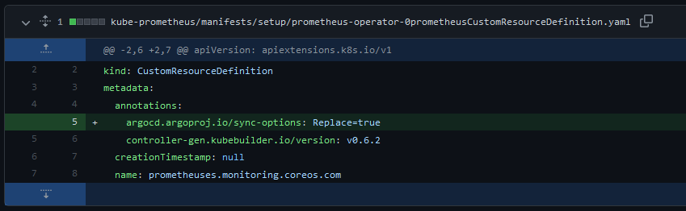

# argocd

ArgoCD - Kube-Prometheus

## Perquisites 

```bash
## Install JB
go install -a github.com/jsonnet-bundler/jsonnet-bundler/cmd/jb@latest

## Install gojsontoyaml
go install github.com/brancz/gojsontoyaml@latest

## Install jsonnet
go install github.com/google/go-jsonnet/cmd/jsonnet@latest

```

## Usage

### Install the required version of kube-prometheus using the [Compatibility Matrix](https://github.com/prometheus-operator/kube-prometheus/tree/release-0.10#kubernetes-compatibility-matrix)
```bash
cd kube-prometheus
jb install github.com/prometheus-operator/kube-prometheus/jsonnet/kube-prometheus@main # Creates `vendor/` & `jsonnetfile.lock.json`, and fills in `jsonnetfile.json`

## Compile the manifests
./build.sh kube-prometheus.jsonnet # Creates ./manifests and ./manifests/setup folders and populates with manifests files
```
### Add `argocd.argoproj.io/sync-options: Replace=true` annotation to `prometheus-operator-0prometheusCustomResourceDefinition.yaml` 

[]

[Example](https://github.com/whume/argocd/commit/d46272f57398eca3ca50aa252cd8def5af88702c?diff=unified)

## License
[MIT](https://choosealicense.com/licenses/mit/)